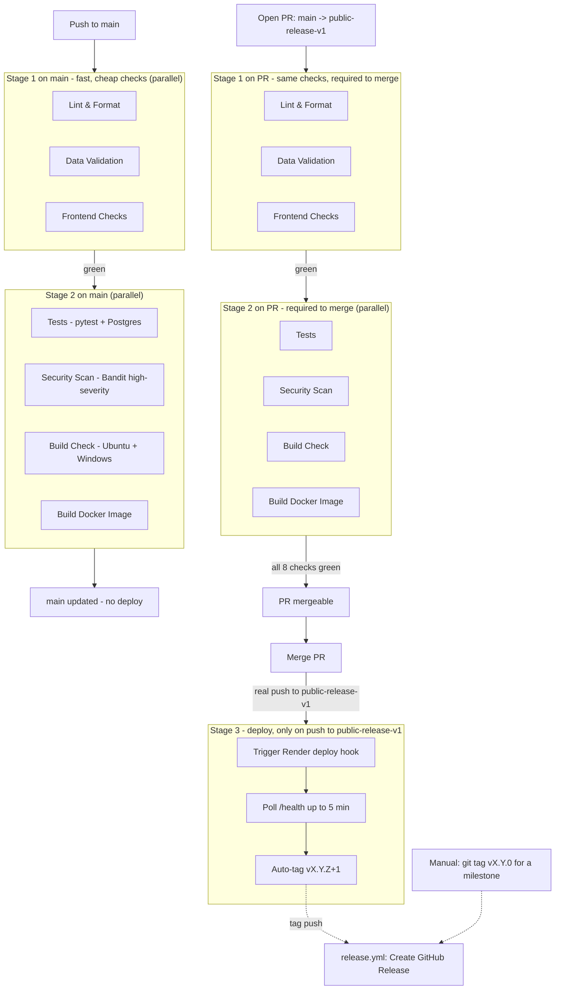

# CI/CD Pipeline

## Branch model

- **`main`** — day-to-day working branch. Pushes here run the full pipeline
  (Stages 1–2) but never deploy. No branch protection — pushing is instant.
- **`public-release-v1`** — production. Protected: GitHub rejects any direct
  push unless all 8 required status checks have already passed on that
  exact commit. The only way to land a change here is a pull request from
  `main` that has gone fully green, then merged.

## Pipeline

## What each stage does

**Stage 1 (parallel, ~1-3 min each)**
- **Lint & Format** — flake8 (real syntax/undefined-name errors fail the
  build; style issues reported only), black formatting check (a real gate)
- **Data Validation** — all JSON valid, recipe/category/theme/i18n structure
- **Frontend Checks** — HTML template structure, CSS files present

**Stage 2 (parallel, only if Stage 1 is green, ~1-5 min each)**
- **Tests** — full pytest suite against a real Postgres service container
- **Security Scan** — Bandit (`--severity-level high`, fails only on High
  findings), Safety dependency check (reported only)
- **Build Check** — dependency install + Flask/core import check on Ubuntu
  and Windows
- **Build Docker Image** — confirms the production Docker image builds

**Stage 3 (only on a real push to `public-release-v1`, i.e. a PR merge —
never on `main` pushes or PR-only runs)**
- Triggers the Render deploy hook
- Polls `https://menuplanner.no/health` for up to 5 minutes to confirm the
  live site is actually healthy
- Auto-tags a new patch version (`vX.Y.Z` → `vX.Y.Z+1`), which also fires
  `release.yml` to create a GitHub Release

A manual minor/major bump (`git tag vX.Y.0 && git push github vX.Y.0`) is
separate from this flow and only done on request, for a change that feels
like a milestone rather than a routine patch.

## Keeping this doc in sync

This diagram is a static snapshot, not generated from `ci.yml` — it will
not update itself. Whenever `ci.yml`, `release.yml`, or the
`public-release-v1` branch protection rules change, update this file in
the same change.
