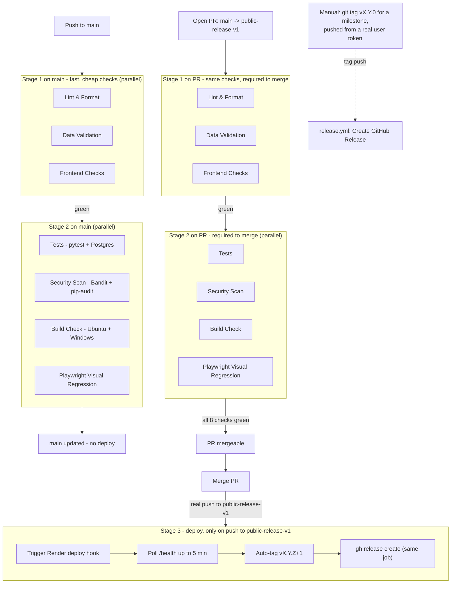

# CI/CD Pipeline

## Branch model

- **`main`** — day-to-day working branch. Pushes here run the full pipeline
  (Stages 1–2) but never deploy. No branch protection — pushing is instant.
- **`public-release-v1`** — production. Protected: GitHub rejects any direct
  push unless all 8 required status checks have already passed on that
  exact commit (3 in Stage 1 + Tests, Security Scan, Build Check x2 OSes,
  and Playwright visual regression in Stage 2 - the Playwright job was
  added 2026-07-07, see B62 in `CHANGELOG.md`). The only way to land a
  change here is a pull request from `main` that has gone fully green,
  then merged.

## Pipeline

## What each stage does

**Stage 1 (parallel, ~1-3 min each)**
- **Lint & Format** — flake8 (real syntax/undefined-name errors fail the
  build; style issues reported only), black formatting check (a real gate)
- **Data Validation** — all JSON valid, recipe/category/theme/i18n structure
- **Frontend Checks** — HTML template structure, CSS files present

**Stage 2 (parallel, only if Stage 1 is green, ~1-5 min each)**
- **Tests** — full pytest suite against a real Postgres service container
- **Security Scan** — Bandit (`--severity-level high`, fails only on High
  findings) **and** `pip-audit -r requirements.txt` (fails on any CVE
  finding). Was `safety check || true` until 2026-07-07 (B54) - that never
  actually gated the build (`|| true` swallowed every finding) and modern
  `safety` v3.x requires a hosted-platform login just to run, so it may
  have been silently failing to even authenticate. `pip-audit` is free,
  offline (OSV database), and the `|| true` is gone - a real CVE now fails
  the build.
- **Build Check** — dependency install + Flask/core import check on Ubuntu
  and Windows
- **Playwright Visual Regression** (added 2026-07-07, B62) — 7 projects
  (chromium/firefox/webkit desktop + iPhone SE/iPhone 14/iPad Pro
  11/Pixel 7), `toHaveScreenshot()` diffing against committed baselines on
  dashboard/shopping-list/all-recipes/add-recipe. Seeds its own test data
  with a fixed `seed=42` (B68) so baselines don't flake from random menu
  content.

**Stage 3 (only on a real push to `public-release-v1`, i.e. a PR merge —
never on `main` pushes or PR-only runs)**
- Triggers the Render deploy hook
- Polls `https://menuplanner.no/health` for up to 5 minutes to confirm the
  live site is actually healthy
- Auto-tags a new patch version (`vX.Y.Z` → `vX.Y.Z+1`) and creates the
  GitHub Release **directly in this same job** (`gh release create`) - NOT
  via `release.yml`. GitHub deliberately blocks a `GITHUB_TOKEN`-authored
  push from triggering other workflows (anti-loop protection), so a tag
  pushed by this job's own token was silently invisible to `release.yml`'s
  `on: push: tags:` trigger - confirmed 2026-07-07 via
  `gh run list --workflow=release.yml` showing zero runs ever fired from
  an auto-tag, despite tags like `v1.1.1`/`v1.1.2` genuinely existing on
  GitHub with no Release to show for them. `release.yml` is now only
  reachable via a manually-pushed tag from a real user token (see below).

A manual minor/major bump (`git tag vX.Y.0 && git push github vX.Y.0`,
pushed from a real user's local git, not CI) is separate from this flow
and only done on request, for a change that feels like a milestone rather
than a routine patch - this path still correctly triggers `release.yml`,
since it isn't pushed by `GITHUB_TOKEN`.

## Deployment platform (M3, resolved 2026-07-09)

Render runs this app via its native Python buildpack (`Procfile` +
`runtime.txt`), **not** Docker - confirmed via the documented Render
Build/Start commands (see "Deployment" in `docs/DEVELOPER_GUIDE.md`),
which match `Procfile`'s single-worker `gunicorn` invocation exactly, and
via `docker-entrypoint.sh` (now deleted) explicitly referencing Railway
persistent volumes, a different, no-longer-used hosting platform. The
`Dockerfile`/`docker-compose.yml`/`docker-entrypoint.sh` split-brain this
repo used to carry (4 workers + auto-migrations in the unused Docker path
vs. 1 worker + no migration step in the actually-live Procfile path) has
been deleted outright, along with the CI "Build Docker Image" job that
built it as a smoke test. `Procfile` is now the only deployment
definition, so there's nothing left to disagree with it.

## Rollback

If a deploy to `public-release-v1` causes a problem in production:

1. **Check Render's Logs tab** first to understand what's actually failing
   (database connection, an unhandled exception, a missing env var).
2. **Revert the problem commit** on `public-release-v1` (`git revert
   <sha>`), or check out the previous auto-tagged version (`git tag -l
   'v*'` to find it) and push that state through the normal PR flow above
   — don't force-push directly to `public-release-v1`, it's branch-protected
   and a force-push would be rejected anyway.
3. **Pushing the revert through the same PR-and-merge flow** re-triggers
   Stage 3, which redeploys the last-good code and re-confirms `/health`.
4. If the problem is data-related rather than code (e.g. a bad migration),
   check `alembic current` against the Neon database via the Render Shell
   before assuming a code revert alone will fix it — some issues need a
   corresponding data fix, not just a code rollback.

## Keeping this doc in sync

This diagram is a static snapshot, not generated from `ci.yml` — it will
not update itself. Whenever `ci.yml`, `release.yml`, or the
`public-release-v1` branch protection rules change, update this file in
the same change.
